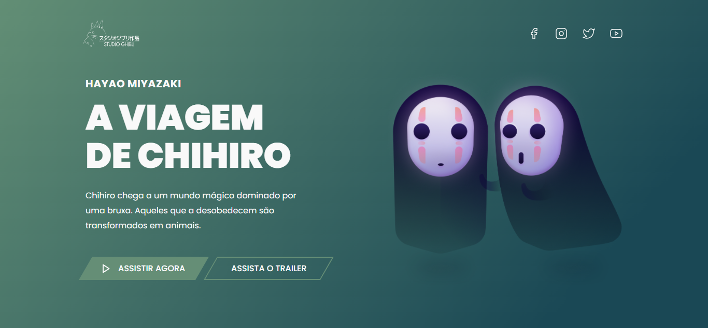

# Desafio 05 da comunidade Codelândia no Discord

## 💻 _studioGhibli_

Repositório criado para armazenar o desafio 05 proposto por Iuri Silva criador da comunidade Codelândia no Discord.

## 💻  Projeto desenvolvido
<a href="https://gabrieldiasdev.github.io/studioGhibli/" target="_blank">Acesse o projeto</a>

## 👨‍💻 Autor

Gabriel Dias Catarin, desenvolvedor front-end | Bauru, São Paulo

[ LinkedIn](https://www.linkedin.com/in/gabriel-dias-260857207/)
&nbsp;